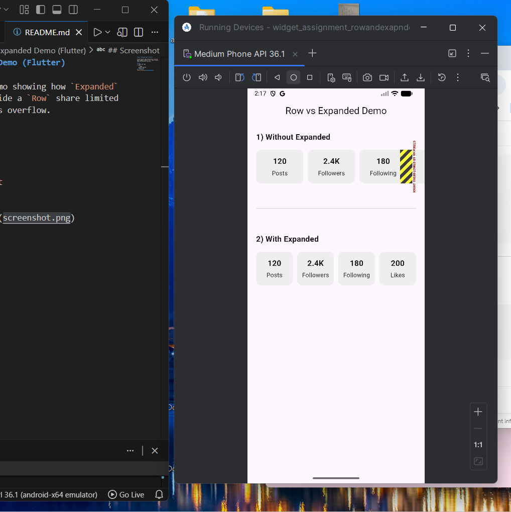

# Row + Expanded Demo (Flutter)

A tiny Flutter demo showing how `Expanded` makes widgets inside a `Row` share limited space and prevents overflow.

## Run
1. Clone the repo
2. Run:
   ```bash
   flutter pub get
   flutter run
## Screenshot
Make sure to have an output similar to this
